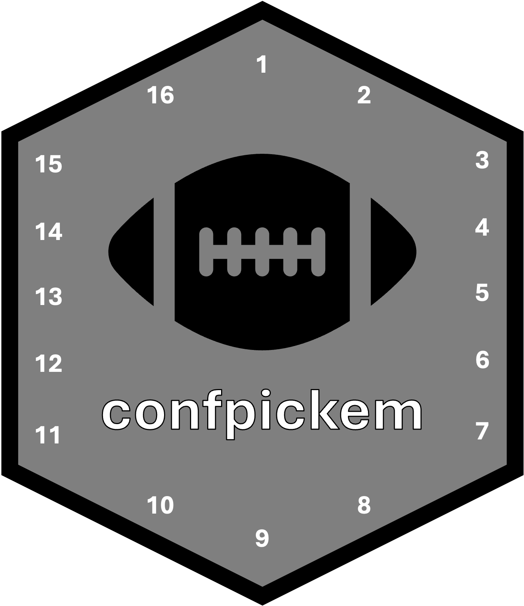

<table>
<tr>
  <td></td>
  <td>
    <h1>confpickem - NFL Confidence Pick'em Analyzer</h1>
    A Python package for analyzing and optimizing picks for NFL Confidence Pick'em pools. This package provides tools for:
    - Scraping Yahoo Pick'em league data
    - Analyzing pick distributions and trends
    - Simulating outcomes and optimizing picks
    - Evaluating different picking strategies
  </td>
</tr>
</table>

## Installation

You can install the package using pip:

```bash
pip install confpickem
```

## Quick Start

### Command Line Interface (Recommended)

The easiest way to use confpickem is through the unified CLI tools:

```bash
# Optimize your picks for mid-week with live odds
python src/confpickem/cli/optimize.py --week 10 --mode midweek --live-odds

# Check win probabilities for all players
python src/confpickem/cli/win_probability.py --week 10 --live-odds

# Update player skills from historical data
python src/confpickem/cli/player_skills.py update --weeks 3,4,5,6,7,8,9 --week 10
```

See the [CLI Documentation](src/confpickem/cli/README.md) for full details.

### Python API

You can also use the package programmatically:

```python
from confpickem import YahooPickEm, ConfidencePickEmSimulator, run_simulation

# Initialize scraper with your league info
yahoo = YahooPickEm(
    week=1,
    league_id=YOUR_LEAGUE_ID,
    cookies_file='cookies.txt'
)

# Run simulation with actual picks
simulator, stats = run_simulation(yahoo)

# Print expected points and win percentages
print("\nExpected Points by Player:")
print(stats['expected_points'])
print("\nWin Percentages:")
print(stats['win_pct'])
```

## Features

### 🎯 Unified CLI Tools
- **optimize.py** - Comprehensive pick optimization with live odds support
- **win_probability.py** - Monte Carlo win probability calculator
- **player_skills.py** - Historical performance analysis and skill modeling

### 📊 Yahoo Data Scraping
- Scrape pick distributions and crowd confidence levels
- Track actual picks and results from your league
- Cache responses to avoid excessive requests

### 🎲 Simulation and Analysis
- Monte Carlo simulation of game outcomes
- Player skill modeling and analysis
- Pick optimization algorithms
- Risk/reward and game importance analysis

### 🔴 Live Vegas Odds Integration
- Real-time betting line integration via The Odds API
- More accurate win probabilities than Yahoo spreads
- Automatic fallback to Yahoo data when API unavailable

### 🧠 Strategy Optimization
- Evaluate different picking strategies
- Optimize confidence point assignments
- Mid-week re-optimization with completed game results
- Fast mode for quick decisions (~85% accuracy, 10x speed)

## Dependencies

- Python ≥ 3.8
- requests
- pandas 
- numpy
- beautifulsoup4
- scipy

## Documentation

- **[CLI Tools Guide](CLI_README.md)** - Comprehensive guide for command-line tools
- **[CLI Tools (in package)](src/confpickem/cli/README.md)** - Detailed CLI documentation
- **[GitHub Repository](https://github.com/tefirman/confpickem)** - Source code and issues

## Contributing

Contributions are welcome! Please feel free to submit a Pull Request.

## License

This project is licensed under the MIT License - see the LICENSE file for details.